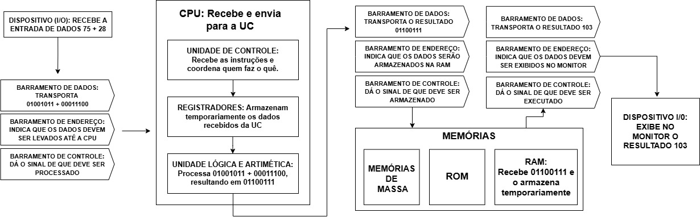

# ArqQuiz 🖥️

Projeto acadêmico desenvolvido para a disciplina de Agentes Inteligentes em Plataformas Informatizadas..

O objetivo do projeto é apresentar alguns conceitos básicos sobre arquitetura de computadores através de um quiz, onde terão:

* CPU
* ULA
* Registradores
* Memórias
* Barramentos
* DMA
* Dual Core e Quad Core
* Entre outros componentes importantes

---

## Tecnologias utilizadas

* HTML
* CSS
* JavaScript

---

## Funcionalidades

* Sistema de perguntas e respostas
* Verificação de acertos
* Interface interativa
* Explicação de conceitos básicos de hardware

---

## Arquitetura Técnica

---

## Objetivo acadêmico

Este projeto foi desenvolvido com fins educacionais, para reforçar os conteúdos estudados em sala de aula sobre arquitetura básica e organização de computadores.
